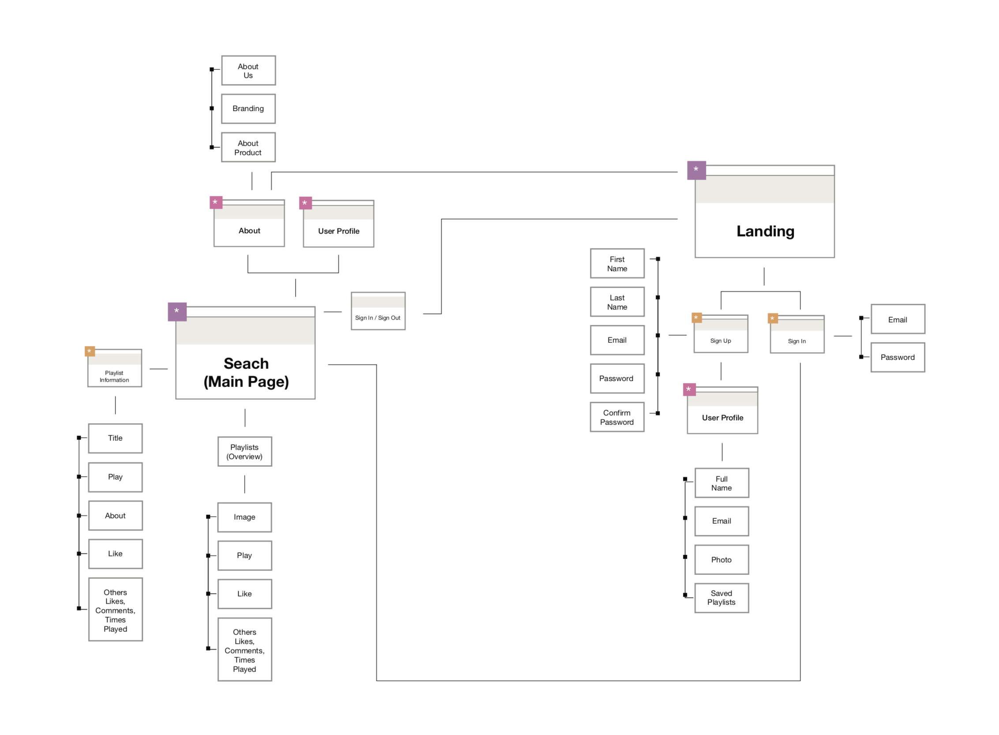
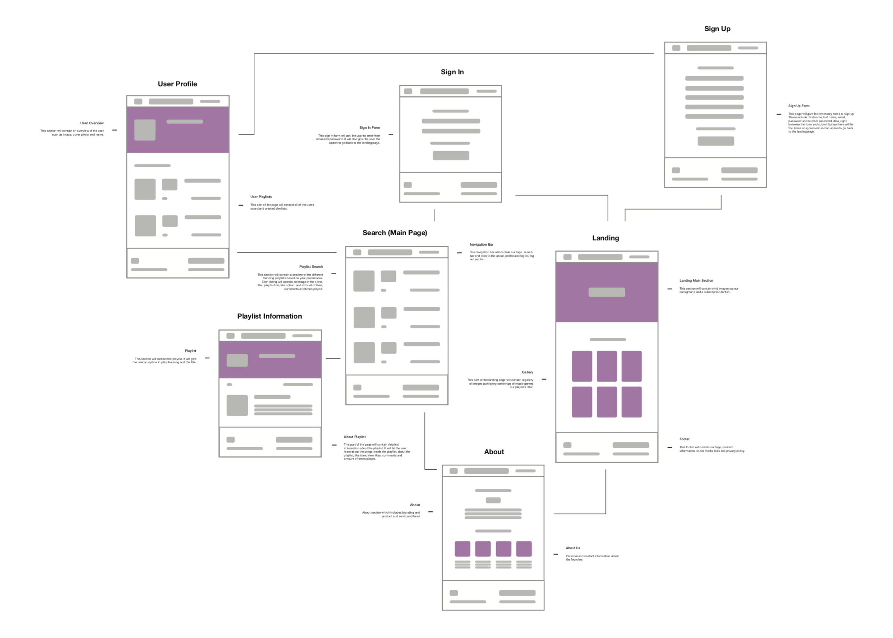
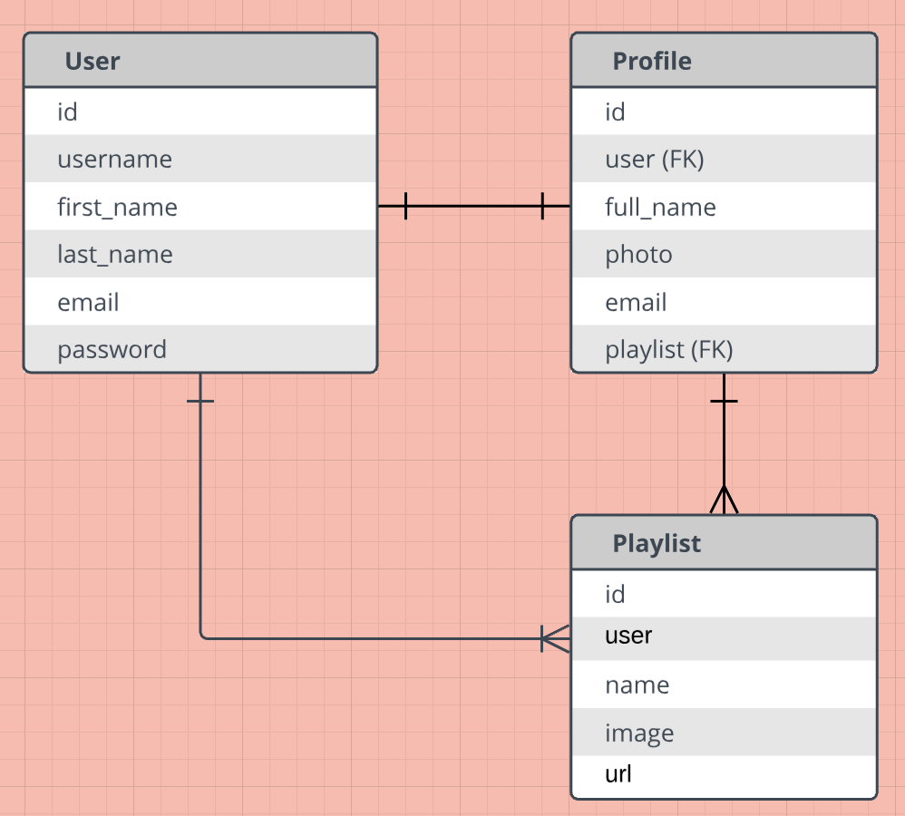

## MEENStream
MEENStream is a visually striking Spotify companion app that gives music fanatics a fresh way to find and save the artists, albums, tracks and playlists they love!

[View on Heroku](https://meenstream.herokuapp.com)

## Wireframes & User Flow

## Entity Relationship Diagram

## Features
User Stories: https://trello.com/b/jvZch0l8/music-app
* Register, Log in, Log out
* Front-end and back-end form validation
* Search for and save tracks, artists, albums, and playlists
* View saved items 

## Technologies
* Django
* Python
* HTML
* CSS
* Spotify API

## Future Development
* Create multiple playlists
* Edit profile photo and personal info
* View other users' profiles
* Login direct to last track

## MEENStream Team
### Mark Mandell https://git.generalassemb.ly/markman0922
### Emily Lane https://git.generalassemb.ly/EmilyHL
### Evan Reinstein https://git.generalassemb.ly/EvanReinstein
### Natasha Quijano https://git.generalassemb.ly/natashaquijano

[MEENStream GitHub Repo](https://git.generalassemb.ly/markman0922/music-app)

